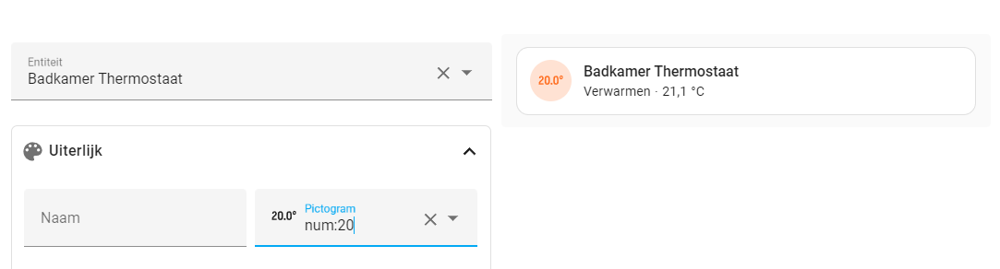
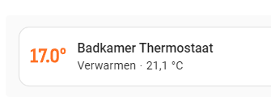

# Number Icons for Home Assistant

Adds SVG icons based on numbers for Home Assistant. These can be used for setting or showing temperatures within Home Assistant.

## Installing

### HACS

1. Add this repo as custom repo to HACS
2. Install this component

### Manual

1. Copy the `dist/ha-number-icons.js` to your `/config/www/` directory
2. Enable advanced mode to [register resources](https://developers.home-assistant.io/docs/frontend/custom-ui/registering-resources)
3. Add `/local/ha-number-icons.js` as a custom resource

## Usage

Everywhere that you can use an icon, you can use `num:` prefix to get a number. Examples:


I also tend to combine this with card-mod to get a better view of the temperature. A full example:

```yaml
type: tile
entity: climate.bathroom
card_mod:
  style:
    .: |
      
      :host { 
        --card-mod-icon: num:{{ iif(is_heating, state_attr(config.entity, 'temperature'), 'off') }}
      }
      ha-tile-icon { --mdc-icon-size: 40px;  }
    ha-tile-icon$: |
      .shape { 
        width: unset!important;
        height: unset!important; 
        overflow: visible!important; 
      }
      .shape::before {--tile-icon-color: transparent;}
```
which yields me with:


This will set the current temperature as an icon, the same way Apple does this with Homekit.

## Development

### Installation

```bash
# Install all dependencies
npm install

# Re-install text-to-svg from master
rm -rf node_modules/text-to-svg
git clone --depth=1 https://github.com/congpeijun/text-to-svg.git -b congpeijun-patch-1 node_modules/text-to-svg
npm install --prefix node_modules/text-to-svg
npm run build --prefix node_modules/text-to-svg
```

### Generate

You can generate your own number icons with `npm run generate`.
